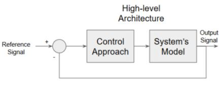
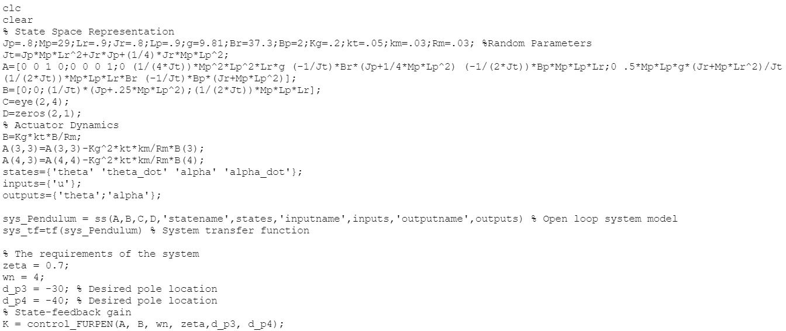

# MECA-482: Control System Design

Furuta Pendulum

Spring 2020, California State University of Chico

Project Managers: Danny Cervantes, Luis Dominguez, Victor Landa, Laura Jhoana Lopez, and Juan Ruiz 

### Table of Contents
- [1. Introduction](#1-Introduction)
- [2. Modeling](#2-Modeling)
- [3. Sensor Calibration](#3-Sensor_Calibration)
- [4. Controller Design and Simulations](#4-Controller_Design_and_Simulations)
- [5. Appendix A: Simulation Code](#5-Appendix_A:_Simulation_Code)
- [6. References](#6-References)

## 1. Introduction
The Furuta Pendulum consists of a driven arm which rotates in the horizontal plane and a pendulum attached to that arm which is free to rotate in the vertical plane. The goal of the project is to use a control system to balance a beam up vertically by controlling the motors position on a gantry. There are 2 encoders that measure the 360 degree position of the motor and the angle of the beam with respect to the floor. The system will keep the beam upright and prevent it from falling by moving to the location needed to balance the beam using a 90 degree angle. This project is purely virtual therefore, our group used MATLAB and MATLAB's SIMULINK to demonstrate the inverted pendulum project with linear and non-linear control algorithms. To display how the project works virtually, the program CoppeliaSim was used which the Furuta Pendulum was created and programmed with the MATLAB code we created.

## 2. Modeling

#### Controller Calculations:

#### Variables :
	
x = position of arm

θ = angle of pendulum with respect to ground

F = applid force

m = mass of pendulum

l = length of pendulum 

g = gravity

fo = coefficient of friction

With two degrees of freedom the following equations are produced by the system:

##### Figure 1: Displays the system's model

##### Figure 2: Displays the control theory model of the Furuta Pendulum

----------------------------------------------------------------------------------
## 3. Sensor Calibration
There was no sensor calibration for this project due to the entirety of the project being virtual.

-----------------------------------------------------------------------------------------------------
## 4. Controller Design and Simulation

##### Figure 3: Image of the Furuta Pendulum designed using Coppelia

Simulation can be seen in action on github labeled "2011214247_received_240794620526014_1832625.mp4" (was having difficulty uploading the video onto the actual website)

-----------------------------------------------------------------------------------------------------

## 5. Appendix A: Simulation Code

clc

clear

% State Space Representation

Jp=.5;Mp=6;Lr=12;Jr=.6;Lp=15;g=9.81;Br=10;Bp=15;Kg=16;kt=2;km=3;Rm=.3;

Jt=Jp*Mp*Lr^2+Jr*Jp+(1/4)*Jr*Mp*Lp^2;

A=[0 0 1 0;0 0 0 1;0 (1/(4*Jt))*Mp^2*Lp^2*Lr*g (-1/Jt)*Br*(Jp+1/4*Mp*Lp^2) (-1/(2*Jt))*Bp*Mp*Lp*Lr;0 .5*Mp*Lp*g*(Jr+Mp*Lr^2)/Jt (1/(2*Jt))*Mp*Lp*Lr*Br (-1/Jt)*Bp*(Jr+Mp*Lp^2)];

B=[0;0;(1/Jt)*(Jp+.25*Mp*Lp^2);(1/(2*Jt))*Mp*Lp*Lr];

C=eye(2,4);

D=zeros(2,1);

% Actuator Dynamics

B=Kg*kt*B/Rm;

A(3,3)=A(3,3)-Kg^2*kt*km/Rm*B(3);

A(4,3)=A(4,4)-Kg^2*kt*km/Rm*B(4);

sys_ss=ss(A,B,C,D) % System state space 

% Finding Open-loop Poles

poles=eig(A)

sys_tf=tf(sys_ss) % System transfer function

[zeros poles gain]=zpkdata(sys_tf)

--------------------------------------------------
## 6. References
1. Wikipedia, Furuta Pendulum, Retrieved by Feb., 25, 2020 from
https://en.wikipedia.org/wiki/Furuta_pendulum

2. Control System Tutorials for MATLAB and Simulink, Retrieved by Feb., 25, 2020 from
http://ctms.engin.umich.edu/CTMS/index.php?example=InvertedPendulum&section=SystemModeling

3.  Quanser, Rotary Inverted Pendulum, Retrieved by Jan, 27, 2020 from
https://www.quanser.com/products/rotary-inverted-pendulum/

